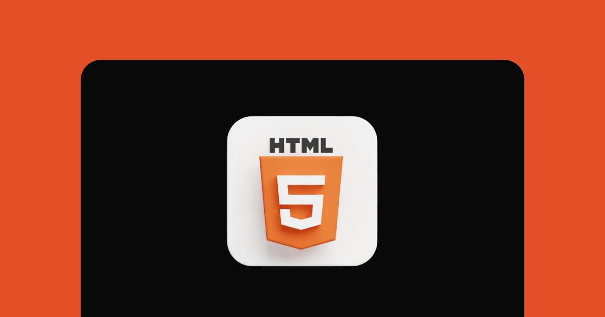

<h1 align="center"> Desafios HTML</h1>

  <a href="#-tecnologias">Tecnologias</a>&nbsp;&nbsp;&nbsp;|&nbsp;&nbsp;&nbsp;
  <a href="#-projeto">Projeto</a>&nbsp;&nbsp;&nbsp;|&nbsp;&nbsp;&nbsp;
  <a href="#-desafio">Desafio</a>&nbsp;&nbsp;&nbsp;|&nbsp;&nbsp;&nbsp;

 

  

## 🚀 Tecnologias

Esse projeto foi desenvolvido com:

- HTML

## 💻 Projeto

Desafios HTML é um pequeno projeto da Rocketseat, para consolidar os conhecimentos aprendidos em aula

- [Acesse o projeto finalizado, online](https://pietroas.github.io/Desafios-HTML/)

## 🔖 Desafio

Você pode visualizar as Instruções para esse desafio através [DESSE LINK](https://efficient-sloth-d85.notion.site/Desafios-HTML-ed0f6368d34d44ffab92686b9dc93229).

---

Feito com ♥ by Rocketseat :wave: [Participe da nossa comunidade!](https://discord.gg/rocketseat)
